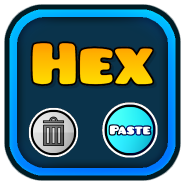

# altuzm.paste_hex_color

> ## **Save yourself 5 seconds now!!**
> 
> Instead of clicking the text field, clearing it, and pasting your hex colour there.. What if you could press a button to clear it, and even better, press another button to clear it *AND* set its text to your clipboard?!
> 
> Crazy, I know. The mod adds 2 buttons to the Editor Color Popup screen, as seen below.
## Showcase
(Notice the 2 new shiny buttons aside the hex colour input field)

